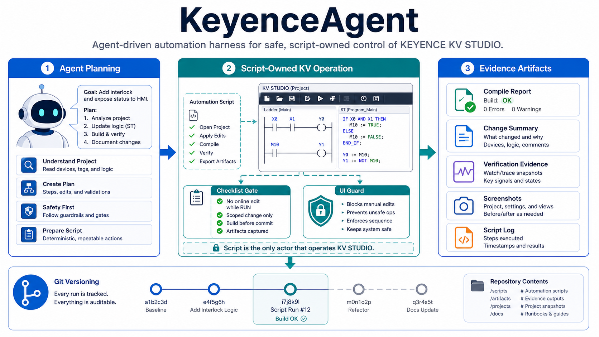
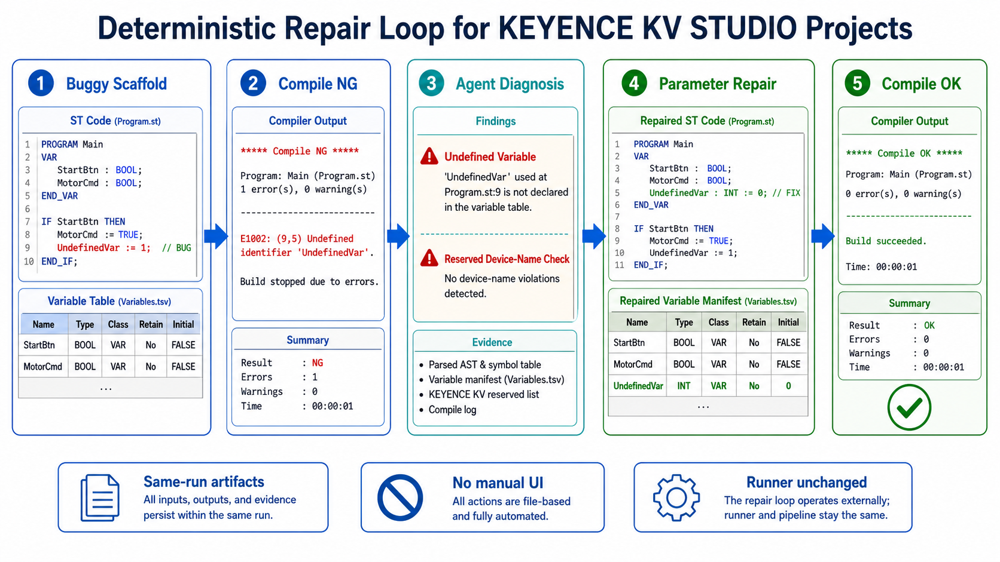

# KeyenceAgent

<p align="center">
  
</p>

<p align="center">
  <a href="https://github.com/xxrust/KeyenceAgent/commits/master"></a>
  <a href="https://github.com/xxrust/KeyenceAgent"></a>
  
  
  
  
</p>

<p align="center">
  <a href="README.md"></a>
  <a href="README.zh-CN.md"></a>
  <a href="README.ja.md"></a>
</p>

<p align="center">
  KEYENCE KV STUDIO プロジェクトを決定的なスクリプトで作成、修復、検証するエージェント駆動の実行フレームワーク。
</p>

> この README の画像は GPT-image2 で生成し、`docs/images/` にリポジトリアセットとして保存しています。

## KeyenceAgent の目的

KV STUDIO の自動化は、エージェントが IDE を見ながらクリック、入力、判断を続けると不安定になります。KeyenceAgent はその作業を実行フレームワークに分離します。

| フェーズ | 担当 | ルール | 証拠 |
| --- | --- | --- | --- |
| 準備 | エージェント | KV STUDIO を開く前に scaffold を編集し、検証ゲートを通します。 | `scaffold_validation.json` |
| 実行 | 実行スクリプト | KV STUDIO 内のすべての UI 操作は実行スクリプトが担当します。 | `artifacts/` |
| 検証 | エージェント | 実行スクリプト終了後に同一実行の結果ファイルだけを読みます。 | `mvp_result.json`、`repair_result.json` |

目標は再現性です。同じ scaffold と同じ実行コマンドから、同じプロジェクト、変数、変換結果、証拠構造を得ます。

## 主な機能

| 機能 | 説明 |
| --- | --- |
| 構造化 scaffold | `scaffold.model.json` を MNM とモジュール別変数 TSV に変換します。 |
| 複数 MNM インポート | 複数のスキャン実行型モジュールを扱い、ローカル変数表を分離します。 |
| 変数入力ガード | フォーカス確認、貼り付けエラー検出、明確なエラーコードで保護します。 |
| コンパイル証拠取得 | KV STUDIO の実際の変換結果テキストをコピーします。 |
| 既存プロジェクト修復 | 対象モジュールを削除/再インポートし、変数を再適用してコンパイルします。 |
| ルート管理 | UIA、キーボード、マウス、スクリプト間の根拠なし切替を防ぎます。 |

## 決定的な修復ループ

<p align="center">
  
</p>

1. 意図的にバグを含む scaffold を作成します。
2. 新規プロジェクト実行スクリプトを実行します。
3. KV STUDIO の実際の `转换结果 NG` テキストを取得します。
4. 診断内容に基づいて scaffold model、MNM、変数一覧を修正します。
5. 修正済み scaffold で既存プロジェクト修復スクリプトを実行します。
6. `repair_result.json.ok=true` かつコピーした変換結果に `转换结果 OK` が含まれる場合だけ成功とします。

## リポジトリ構成

```text
.
├─ README.md
├─ README.zh-CN.md
├─ README.ja.md
├─ docs/
│  └─ images/
├─ kv-studio-operator/
│  ├─ SKILL.md
│  ├─ references/
│  └─ scripts/
└─ route-governance/
```

## 主要スクリプト

| スクリプト | 用途 |
| --- | --- |
| `kv-studio-operator/scripts/render_kv_mvp_scaffold_model.ps1` | 構造化モデルを KV STUDIO 用ファイルに変換します。 |
| `kv-studio-operator/scripts/validate_kv_mvp_scaffold.ps1` | KV STUDIO を開く前に checklist、schema、MNM 種別、危険な変数名を検証します。 |
| `kv-studio-operator/scripts/run_kv_mvp_scaffold.ps1` | 新規プロジェクト作成、MNM インポート、変数入力、コンパイル、結果コピーを実行します。 |
| `kv-studio-operator/scripts/run_kv_mvp_repair_existing_project.ps1` | 修正済み scaffold で既存のエラー `.kpr` を修復します。 |
| `kv-studio-operator/scripts/run_kv_mvp_repeat.ps1` | 連続成功ゲートを実行します。 |

## Scaffold が唯一のソース

構造化プロジェクトは `scaffold.model.json` から始めます。生成された MNM と TSV は KV STUDIO 用のアダプタ成果物です。

```text
scaffold.model.json
CHECKLIST.md
TASK.md
VERSION.md
mnm/<module>.mnm
variables/<module>/global_variables.tsv
variables/<module>/local_variables.tsv
scaffold.json
```

レンダリング:

```powershell
powershell -NoProfile -ExecutionPolicy Bypass -File .\kv-studio-operator\scripts\render_kv_mvp_scaffold_model.ps1 `
  -ModelPath C:\KV_MVP\scaffolds\<task>\scaffold.model.json
```

検証:

```powershell
powershell -NoProfile -ExecutionPolicy Bypass -File .\kv-studio-operator\scripts\validate_kv_mvp_scaffold.ps1 `
  -ScaffoldRoot C:\KV_MVP\scaffolds\<task> `
  -OutDir C:\KV_MVP\scaffolds\<task>\_validation
```

## 新規プロジェクト実行

```powershell
powershell -NoProfile -ExecutionPolicy Bypass -File .\kv-studio-operator\scripts\run_kv_mvp_scaffold.ps1 `
  -ScaffoldRoot C:\KV_MVP\scaffolds\<task> `
  -OutRoot C:\KV_MVP\mvp_runs `
  -TimeoutSeconds 600
```

主な結果:

```text
C:\KV_MVP\mvp_runs\<ProjectName>\mvp_result.json
```

## 既存エラープロジェクト修復

```powershell
powershell -NoProfile -ExecutionPolicy Bypass -File .\kv-studio-operator\scripts\run_kv_mvp_repair_existing_project.ps1 `
  -ProjectPath C:\KV_MVP\mvp_runs\<ProjectName>\Projects\<ProjectName>\<ProjectName>.kpr `
  -ScaffoldRoot C:\KV_MVP\scaffolds\<fixed-task> `
  -OutRoot C:\KV_MVP\repair_runs `
  -DeleteExistingModulesBeforeImport `
  -TimeoutSeconds 600
```

主な結果:

```text
C:\KV_MVP\repair_runs\<ProjectName>\repair_result.json
```

## 変数名の制約

KV STUDIO では `X0`、`Y0`、`R100`、`DM10` のような名前がソフトデバイス名として扱われる可能性があります。変数名には使いません。

業務名を使います:

```text
Pt0X
Pt0Y
Pt1X
Pt1Y
Pt2X
Pt2Y
CenterX
CenterY
FitValid
```

## 検証済みケース

意図的な ST バグ:

```text
CenterX := (0.0 - Bcoff) / (2.0 * Acoef);
```

KV STUDIO の同一 run 診断:

```text
转换结果 NG (错误数量:1  警告数量:0)
QuadFitMain(行:00002)(列: 01)(ST行: 0016)[错误 1232]:"Bcoff": 发现非法的字符串。
```

修復では `Bcoff` を定義済みローカル変数 `Bcoef` に変更しました。既存エラープロジェクト修復と新規エラープロジェクト修復の両方で成功しています。

```text
转换结果 OK (错误数量:0  警告数量:0)
```

## エンジニアリングルール

| ルール | 理由 |
| --- | --- |
| KV STUDIO 操作前に checklist が必要 | 制御されていない UI スクリプト実行を防ぎます。 |
| KV 操作フェーズはスクリプト専有 | エージェントのリアルタイム操作によるフォーカスずれを排除します。 |
| 同一実行の成果物のみ採用 | 古いスクリーンショットやログによる誤判定を防ぎます。 |
| 最初のフィードバックを保存 | 貼り付けエラーとコンパイル診断を実行可能なエラーコードにします。 |
| ルート変更には証拠が必要 | UIA、キーボード、マウス、スクリプト間の無根拠な切替を防ぎます。 |
