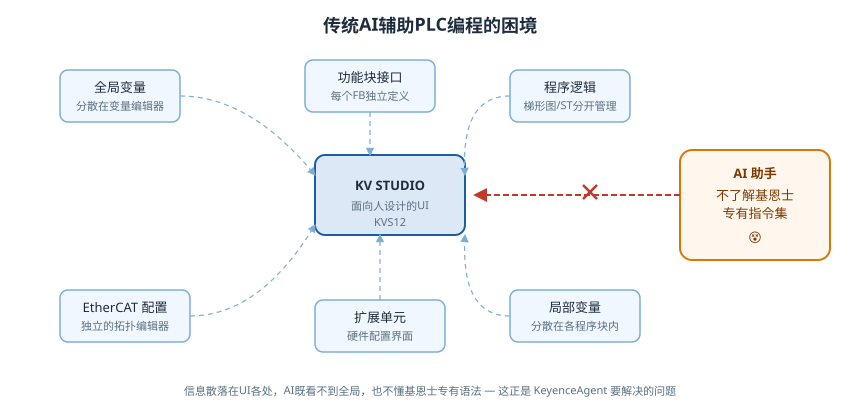
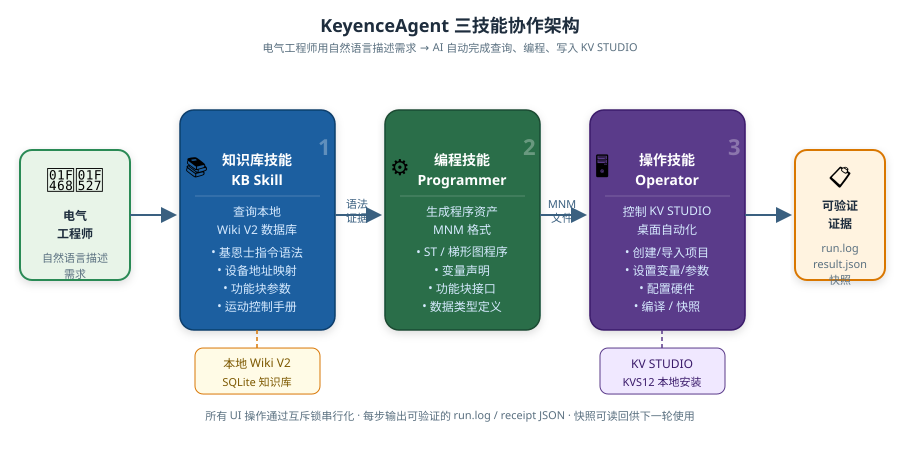
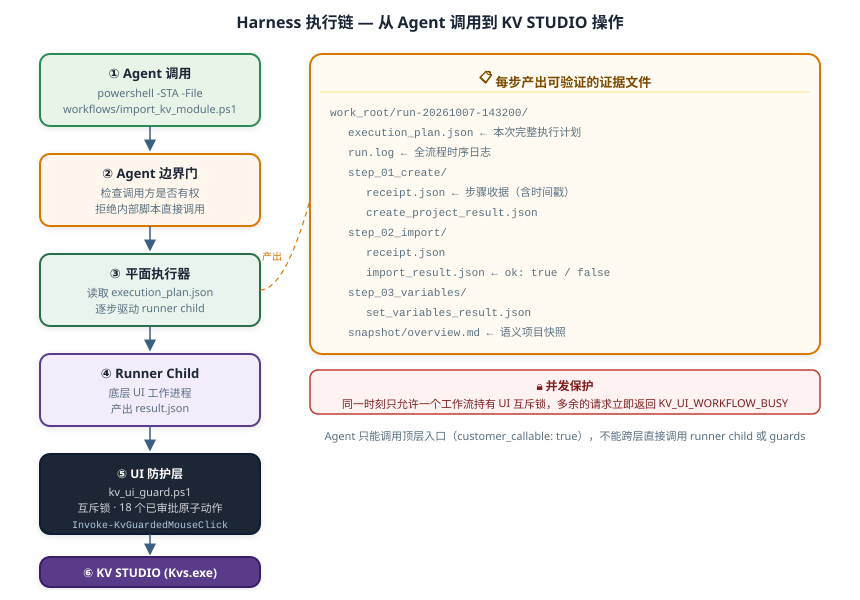
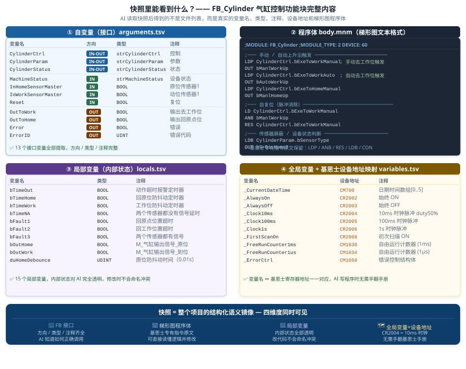

<div align="center">

# KeyenceAgent

**让 AI 真正读懂、写入 KV STUDIO**

*专为使用基恩士 PLC 的电气工程师设计 — 让 AI Agent 代你操作 KV STUDIO，你只需描述需求*

[](LICENSE)
[](#requirements)
[](#requirements)

</div>

---

## 这个项目是为谁准备的

如果你是使用**基恩士 KV 系列 PLC** 的电气工程师，你一定遇到过这些情况：

- 想让 AI 帮你写 ST 程序或梯形图，但 AI 根本不知道 `Z.RSTB`、`MC_MoveAbsolute` 这些基恩士专有指令怎么用
- KV STUDIO 的变量在一个地方，功能块接口在另一个地方，EtherCAT 配置又在别处 — AI 看不到这些，根本没法给出准确的方案
- 你想要的不是"AI 建议我怎么做"，而是 **AI 直接帮我把程序写进 KV STUDIO**

**KeyenceAgent 就是为解决这三个问题而生的。**

它不是给开发者搭 AI 框架用的，它是给**电气工程师**用的 — 一套让 AI Agent 能够真正理解基恩士知识、读取项目全局状态、并直接写入 KV STUDIO 的工具集。

---

## 问题：KV STUDIO 是面向人设计的

<p align="center">
  
</p>

KV STUDIO 的设计目标是让**工程师通过鼠标操作**完成工作。这意味着：

- **全局变量**在变量编辑器里，**局部变量**藏在每个程序块内部
- **功能块接口**需要逐个打开才能看到
- **EtherCAT 配置**在独立的拓扑编辑器中
- **扩展单元**在另一个硬件配置界面

没有任何一个地方能让 AI 看到项目的全貌。加上基恩士有大量专有指令（如 `Z.RSTB`、`MC_MoveAbsolute` 的 KV 特定用法），AI 仅凭通用 IEC 61131-3 知识根本无法给出正确代码。

---

## 解决方案：三个技能协同工作

<p align="center">
  
</p>

KeyenceAgent 把问题分成三层，每层一个技能：

| 技能 | 职责 | 解决什么问题 |
|------|------|-------------|
| **知识库技能** `kv-studio-kb-programming` | 查询本地基恩士 Wiki V2 数据库 | AI 不知道基恩士专有指令 |
| **编程技能** `keyence-plc-programmer` | 生成 MNM 格式程序文件、变量声明、功能块接口 | AI 无法生成正确的 KV STUDIO 程序格式 |
| **操作技能** `kv-studio-operator` | 直接操作 KV STUDIO 桌面 | AI 无法读取/写入散落各处的项目信息 |

三个技能配合形成完整的闭环：**查 → 写 → 导入 → 验证**，每一步都产生可检查的证据文件（`run.log`、`result.json`、项目快照）。

---

## 典型工作流

```
电气工程师说：
  "给 KV-X310 新建一个项目，实现一个 FB：
   输入轴当前位置，输出是否在目标范围内的 BOOL 信号"

AI Agent 自动完成：
  1. [知识库技能] 查 MC_MoveAbsolute、位置比较指令的基恩士专有用法
  2. [编程技能]   生成 ST 程序体 + 变量声明，打包成 MNM 文件
  3. [操作技能]   ① 创建项目  ② 导入 MNM  ③ 设置全局变量  ④ 编译
  4. 输出：run.log + 编译结果 JSON + 项目快照

工程师检查结果，KV STUDIO 里已经有了完整的程序。
```

### Harness 执行链

每次调用工作流，都经过严格的六层执行链。Agent 只能进入最顶层的 `customer_callable` 入口，内部各层对外完全不可见，所有 UI 操作通过互斥锁串行化：

<p align="center">
  
</p>

### 快照：让 AI 看到项目全貌

调用 `export_kv_project_text_snapshot` 工作流，将散落在 KV STUDIO 各处的信息统一导出为结构化语义快照。下图来自一个真实项目（KVX样例程序，含多品牌伺服电机库、ModbusTCP、工站程序）：

<p align="center">
  
</p>

---

## 快速开始

### 环境要求 {#requirements}

- Windows 10 / 11
- Windows PowerShell 5.1
- KEYENCE KV STUDIO KVS12（已安装 `Kvs.exe`）
- Codex AI Agent 运行时
- 基恩士本地 Wiki V2 数据库（联系项目维护者获取）

### 安装

```powershell
# 克隆项目
git clone https://github.com/LiangYH/KeyenceAgent.git
cd KeyenceAgent

# 一键安装检查
powershell -ExecutionPolicy Bypass -File setup_keyence_agent.ps1
```

### 配置

在 `%APPDATA%\Codex\kv-studio-operator\` 下创建 `config.json`：

```json
{
  "kvs_exe": "C:\\Program Files\\KEYENCE\\KV STUDIO\\Kvs.exe",
  "work_root": "C:\\KvAgentWork",
  "admin_credential_path": "%APPDATA%\\Codex\\kv-studio-operator\\credentials.xml",
  "admin_user_default": "Administrator",
  "wiki_root": "D:\\KeyenceWiki"
}
```

> 参考模板：[`kv-studio-operator/config/kv-studio-operator.example.json`](kv-studio-operator/config/kv-studio-operator.example.json)

---

## 项目结构

```
KeyenceAgent/
├── kv-studio-kb-programming/   技能1：查询基恩士知识库
├── keyence-plc-programmer/     技能2：生成 PLC 程序文件
├── kv-studio-operator/         技能3：操作 KV STUDIO 桌面
│   ├── scripts/workflows/      对外发布的工作流（Agent 唯一入口）
│   ├── scripts/guards/         UI 原子操作防护层
│   ├── scripts/runner_children/ 底层 UI 执行器（内部）
│   └── config/                 配置模板
├── docs/                       文档、指南、架构图
├── scripts/                    安装与开发辅助脚本
└── tests/                      回归测试
```

详细的技能说明和工作流文档见 **[Wiki](docs/wiki/)**。

---

## 当前能力状态

| 功能 | 状态 |
|------|------|
| 创建项目、导入 MNM、设置变量 | ✅ 已验证发布 |
| 用户功能块 (FB) 导入与参数配置 | ✅ 已验证发布 |
| ST 数值型 FB 创建（KV-X520） | ✅ 已验证发布 |
| BOOL 梯形图完整模块 | ✅ 已验证发布 |
| 项目快照（全量语义读取） | ✅ 已验证发布 |
| MNM 导出 | ✅ 已验证发布 |
| 结构体类型定义 | ✅ 已验证发布 |
| 扩展单元配置 | ✅ 已验证发布 |
| EtherCAT 节点配置 | ✅ 已验证发布 |
| 新建项目 / 编译（独立工作流） | 🔄 pending_validation |

---

## 贡献

见 [CONTRIBUTING.md](CONTRIBUTING.md)。

## License

[MIT](LICENSE)
