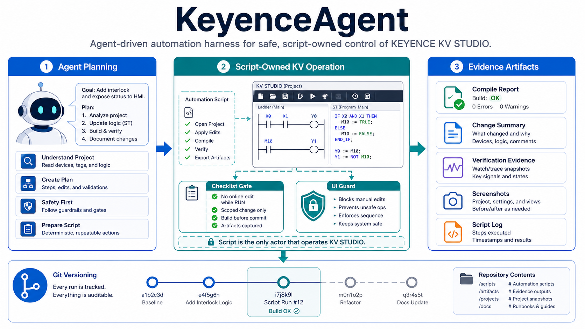

# KeyenceAgent 项目状态（核对版）

更新日期：2026-09-11。本文是 README 的详细证据索引；“已整理”不等于“整理后的版本已重新进行桌面实测”。

## 1. 责任边界

| 层 | 入口/目录 | 责任 |
|---|---|---|
| 知识 | `kv-studio-kb-programming` | 从本机 Wiki 查询 KEYENCE 专有语法和模块资料 |
| 设计 | `keyence-plc-programmer` | MNM、PLC 逻辑、变量、FB 和复刻资产 |
| 执行 | `kv-studio-operator/workflows` | 通过 manifest、Gate、flat executor 操作 KV STUDIO |
| 证据 | `H:\kvOp\system-reliability` | 同次运行的 `run.log`、receipt、快照和结果 |

## 2. 客户态 workflow

能力清单唯一来源是 `kv-studio-operator/scripts/script_manifest.json`。公开入口包括：MNM 导入/导出、变量和 FB 自变量、结构体增删改查、扩展单元配置、EtherCAT 节点配置、项目复刻和快照。

扩展单元：`workflows/configure_kv_expansion_units.ps1`

- 输入型号数组，运行时从 KV STUDIO 兼容目录解析；不限定 B16X/C32X。
- 目标证据：`UnitSet.ue2` 同次读回、项目树确认、干净主窗口。
- 单模块预算：10 秒。
- **回归结果**：2026-09-17 最新运行 `status: pass`，已通过真实桌面回归。

EtherCAT：`workflows/configure_kv_ethercat_nodes.ps1`

- 输入 `nodes`：唯一节点号和 `catalog_model`；已保存的相同映射报告为 `already_persisted`。
- 冲突地址必须失败，不自动重排或压缩源项目拓扑。
- 目标证据：节点地址编辑器读回、`WsTreeEnv.xml` 节点/型号读回、干净主窗口。
- 每节点预算：10 秒。
- **回归结果**：2026-09-17 晚间最新运行 `status: pass`，已通过真实桌面回归。09-17 白天有两次失败记录（`configure_nodes` 步骤 exit_code=1），当日晚间修复后通过。

## 3. 已有回归证据

| 项目 | 结果文件 | 结论 |
|---|---|---|
| FB 自变量/局部变量快照 | `H:\kvOp\system-reliability\published-fb-snapshot\test_result.json` | 4 次复制均 13 行完全匹配；错误焦点被阻止；最大原子动作 1513ms；查找 196ms |
| 结构体导出 | `...\published-structure-snapshot\workflow_result.json` | 成功，4.135 秒；4 个成员读回 |
| 变量快照 | `...\published-variable-snapshot-r2\variable_workflow_result.json` | 成功；25.518 秒（含窗口/项目操作），不是单原子耗时证明 |
| 严格执行器负例 | `...\strict-executor\typed-tests-r2\test_result.json` | 17 个契约/陈旧证据/失败传播用例通过 |

硬件配置的上述两个 workflow 只有 PlanOnly/契约测试证据，不能据此宣称已完成真实插入。

## 4. 未完成或需重新验证

1. 扩展单元插入：真实保存、`UnitSet.ue2` 读回和每模块计时。
2. EtherCAT：非连续节点布局、保存后地址/型号读回和每节点计时。
3. 单元首地址独立修改 workflow。
4. EtherNet/IP 设备注册与 ESI 注册 workflow。
5. `create_kv_project.ps1`、`compile_kv_project.ps1` 虽有手工成功证据，manifest 仍为 `pending_validation`，不可作为公开客户态接口。

## 5. 操作与证据规则

- 必须使用 manifest 中 `customer_callable=true` 的入口；内部 runner 不直接给 agent 调用。
- 每次运行独立输出目录；所有原子动作、输入、结果追加同一个 `run.log`。
- 缺失、陈旧、格式错误或非布尔成功证据一律失败；旧日志不能认证新代码。
- 不展开超过五层 UI 树，不穷举焦点路线；陌生 UI 路线应停止并请求人工确认。
- `(System)` 数据类型不创建、不修改；嵌套类型按依赖顺序创建。

## 6. 截图证据索引

仓库内说明图：

- `docs/images/keyenceagent-harness-overview.png`
- `docs/images/kv-repair-loop.png`

历史 KV STUDIO 截图保存在 `H:\kvOp` 的对应回归目录；例如：

- [EtherCAT 设置界面检查](H:/kvOp/ethercat_model_filter_research/run_20260904_02_inspect_controls/inspect_ethercat_setting.png)
- [MNM 导入前界面](H:/kvOp/plc_scaffold_audit_20260906/ui_scope_fixed/ScopeReuseRegressionFixed/artifacts/import_mnm_1/00_before_import.png)
- [MNM 保存后界面](H:/kvOp/plc_scaffold_audit_20260906/ui_scope_fixed/ScopeReuseRegressionFixed/artifacts/import_mnm_1/04_after_save.png)

这些截图是历史运行证据，不自动代表当前代码版本。需要逐项核对时，应同时检查对应目录的 `code_fingerprint.json`、receipt 和 `run.log`；若目录没有同次指纹，截图只能作为界面参考。
